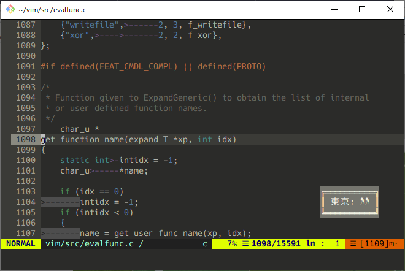

# rainfall.vim
雨が降っていることをお知らせする Vim プラグイン (only for Japanese area)

# スクリーンショット

# 概要
設定した地域の、過去 1 時間の降水量を参照して雨が降っていることを通知します。
参照データには、気象庁の [気象データ高度利用ポータルサイト](https://www.data.jma.go.jp/developer/index.html) を使っています。最新のデータが更新されるまでにおよそ 30 分程度の遅延があるようです。現状では約 5 分に 1 度、情報が更新されていないかを確認しています。

* 過去 1 時間の降水量が 0.0 mm より多く、1.0 mm 以下
    * 傘のマーク 1 つ
* 過去 1 時間の降水量が 1.0 mm より多く、2.0 mm 以下
    * 傘のマーク 2 つ
* 過去 1 時間の降水量が 2.0 mm より多い
    * 傘のマーク 3 つ

# 使用方法
1. プラグインマネージャなどで rainfall.vim を導入する。
1. [地域気象観測所一覧](https://www.jma.go.jp/jma/kishou/know/amedas/ame_master.pdf) の中から表示したい地域の観測所番号 (5桁) を調べる。
1. `.vimrc` 等で `g:rainfall#location_number` に観測所番号を設定する。規定値では東京。
    * `g:rainfall#location_number = 44132`
1. 表示されるマークを変更したければ同様に `g:rainfall#mark` を設定する。規定値では ☂ (U+2602)。

# コマンド
* RainfallEnable
    * 機能を有効にします。5 分毎に情報の確認および更新を行うタイマーを起動します。Vim の起動直後は有効になっています。
* RainfallDisable
    * 機能を無効にします。上述のタイマーを停止します。
* RainfallClose
    * 表示されたポップアップウィンドウを閉じます。情報が変化すると (マークの増減があると) 再度表示されます。

# その他
* バグレポートは issue から報告してもらえると嬉しいです。機能改善に関しても同様。
* TODO
    * ポップアップウィンドウ未対応への対応
    * max-age への対応？
